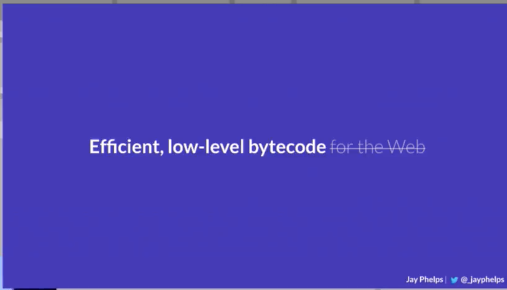

# wasm golang practice example

##



## 目的

觀察 wasm，使用 golang 撰寫簡單 wasm 並且跑在瀏覽器上。

### 啟動方法

-> run nodejs server

```
node index.js
```

-> http://localhost:8080

## 編譯方式 (此範例已編譯完成)

### 版本

golang version >= 1.11.0

### Golang 程式碼

```golang
package main

import "fmt"

func main() {
	fmt.Println("Hello World!")
}
```

### 指令

\* 此份範例無須用到指令

```
> GOROOT=./ GOARCH=wasm GOOS=js ./bin/go build -o example.wasm main.go
```
